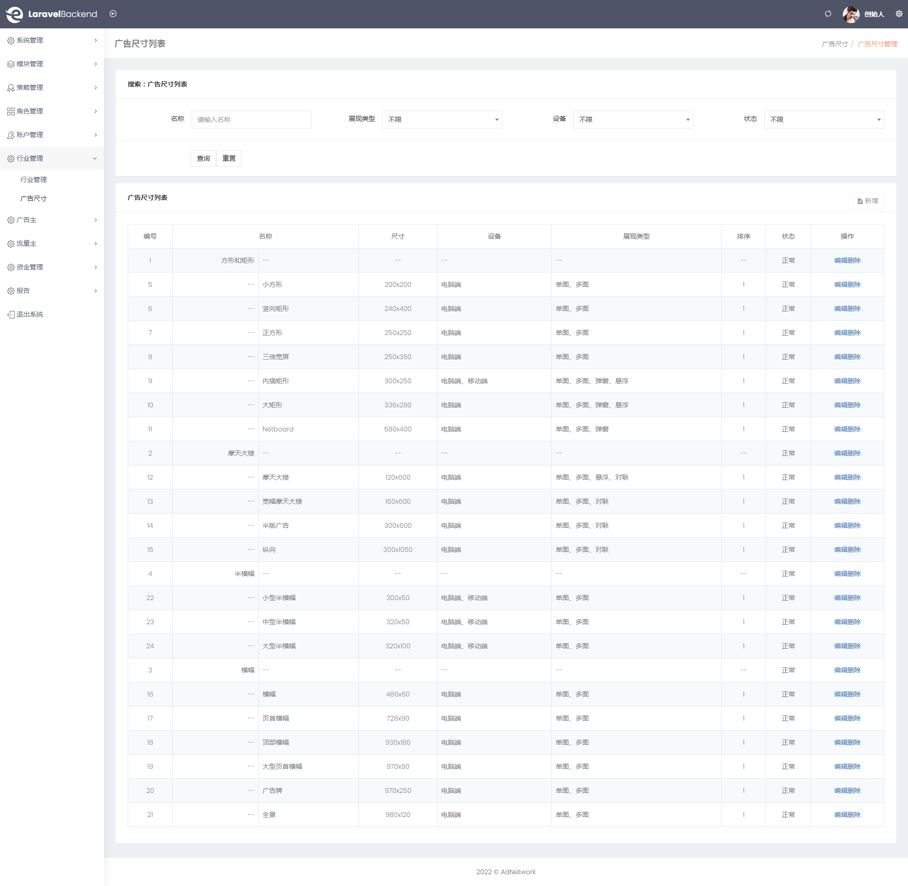

## 耐斯特广告联盟系统

### 功能简介

#### 自定义广告尺寸

- 支持设备：电脑端、移动端
- 展现类型：单图、多图、弹窗、悬浮、对联

#### 广告主

- 广告计划：日限额
- 广告单元：投放日期、投放时段
- 出价方式：CPC、CPM、CPV、CPA、CPS
- 财务管理：充值、提现、交易流水
- 支持充值：支付宝、微信、线下充值
- 支持提现：支付宝、微信、钱包

#### 网站主

- 站点验证方式：文件验证、HTML标签验证
- 广告位类型：联盟广告、本地广告
- 计费方式：智能、CPC、CPM、CPV、CPA、CPS
- 展现类型：单图、多图、悬浮、弹窗、对联
- 广告位空闲设置：显示换量广告、显示本地广告、显示联盟广告、固定占位符、隐藏广告位

### 软件架构

* 编程语言：`PHP 8.1+`
* 后端框架：`Laravel 9.x` + `MySQL 5.7+` + `Redis`
* 前端框架：`Bootstrap v4.0.0` + `EliteAdmin`

### [在线预览](https://www.naisiter.com/)

### 官网


### 运营系统



### 广告主平台


### 网站主平台


### 安装教程

使用 `git` 克隆本项目，导入数据库文件 `ad-network.sql` 或 `database.sql`

- 命令行：`composer install`
- 命令行：`cp .env.example .env`
- 命令行：`php artisan key:generate`

### 修改 `.env` 文件配置

#### 数据库配置

```
DB_HOST=127.0.0.1
DB_PORT=3306
DB_DATABASE=
DB_USERNAME=root
DB_PASSWORD=root
DB_PREFIX=
```

#### `Redis` 配置

```
REDIS_HOST=127.0.0.1
REDIS_PASSWORD=null
REDIS_PORT=6379
```

#### 邮箱配置

```
MAIL_MAILER=smtp
MAIL_HOST=
MAIL_PORT=465
MAIL_USERNAME=
MAIL_PASSWORD=
MAIL_ENCRYPTION=
MAIL_FROM_ADDRESS=
MAIL_FROM_NAME="${APP_NAME}"
```

#### 域名配置

```
STATIC_DOMAIN=http://adwords.me.yunduanchongqing.com/upload/
DOMAIN_BACKEND=backend.me.yunduanchongqing.com
DOMAIN_ADVERTISEMENT=e.me.yunduanchongqing.com
DOMAIN_PUBLISHMENT=union.me.yunduanchongqing.com
DOMAIN_RENDER=render.me.yunduanchongqing.com
DOMAIN_ANALYSIS=ads.me.yunduanchongqing.com
```

测试环境推荐使用以下域名配置（数据库中已经使用了相关域名，正式环境请清空测试数据库并修改相关域名配置）

### 站点配置

#### 以 `nginx` 配置为例：

```
server 
{
    listen 80;
    server_name www.me.yunduanchongqing.com backend.me.yunduanchongqing.com e.me.yunduanchongqing.com union.me.yunduanchongqing.com adwords.me.yunduanchongqing.com render.me.yunduanchongqing.com ads.me.yunduanchongqing.com; 
    index index.php index.html index.htm default.php default.htm default.html;
    root /www/naisiter/public;
    ...
    #Laravel rewrite 规则请参考 laravel 官网
    include rewrite/naisiter.conf;
}
```

#### 站点说明：

- [官网：http://www.me.yunduanchongqing.com](https://www.me.yunduanchongqing.com/)
- [运营系统：http://backend.me.yunduanchongqing.com](https://backend.me.yunduanchongqing.com/)
- [广告主平台：http://e.me.yunduanchongqing.com](https://e.me.yunduanchongqing.com/)
- [网站主平台：http://union.me.yunduanchongqing.com](https://union.me.yunduanchongqing.com/)
- [静态资源：http://adwords.me.yunduanchongqing.com](https://adwords.me.yunduanchongqing.com/)
- [广告渲染引擎：http://render.me.yunduanchongqing.com](https://render.me.yunduanchongqing.com/)
- [广告分析引擎：http://ads.me.yunduanchongqing.com](https://ads.me.yunduanchongqing.com/)

### 队列任务

```shell
php artisan queue:work
```

### 广告演示

[广告演示](https://www.me.yunduanchongqing.com/demo/)
